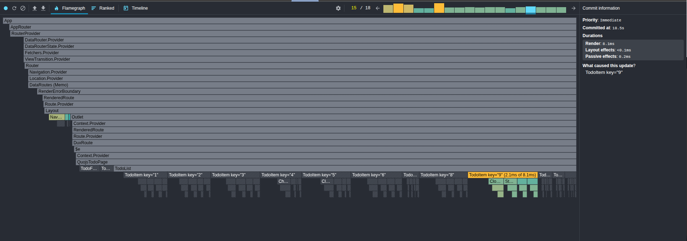

# Quo.js vs Redux Toolkit: Análisis con _profiler_

## Escenario de Prueba

Ambas implementaciones renderizan la misma lista de tareas (para evitar la confución con la palabra _ToDo_ en Ingles) interactiva:

- **Todo Factory** para la creación de _tareas_.
- **Todo Filters** para filtrar _tareas_ por estado y categoría.
- **Todo List** con _tareas_ que pueden activarse/desactivarse.

Este escenario pone a prueba el rendimiento de re-renderizado. Quo.js destaca gracias a sus
**suscripciones granulares** nativas.

## Flamegraphs de Quo.js (Frames 02–10)

Las actualizaciones de Quo.js son consistentemente **planas y localizadas**. Cada commit toca
únicamente el componente suscrito a la _tarea_ afectada.

| Frame | Captura                                                                 | Notas                                                                                                                            |
| ----- | ------------------------------------------------------------------------ | -------------------------------------------------------------------------------------------------------------------------------- |
| 01    |  | Render inicial.                                                                                                                  |
| 02    |  | Llegan las _tareas_ (fetched), se renderiza la lista completa.                                                                       |
| 03    |  | Se recalculan los filtros ya que todas las _tareas_ traídos pertenecen a la categoría `fetched`.                                    |
| 04    |  | Se pega la palabra `test` en el campo `title` desde el componente de la fábrica de todos. Actualización localizada en <TodoFactory />. |
| 05    |  | Se pega la palabra `test` en el campo `category` desde el componente de la fábrica de todos. Actualización localizada en <TodoFactory />. |
| 06    |  | Se presiona el botón `Add`, se crea una nueva _tarea_. La lista completa se vuelve a renderizar.                                      |
| 07    |  | Se activa la _tarea_ con ID `1`. Actualización atómica.                                                                              |
| 08    |  | Se activa la _tarea_ con ID `2`. Actualización atómica.                                                                              |
| 09    |  | Se activa la _tarea_ con ID `3`. Actualización atómica.                                                                              |
| 10    |  | Se activa la _tarea_ con ID `4`. Actualización atómica.                                                                              |
| 11    |  | Se activa la _tarea_ con ID `5`. Actualización atómica.                                                                              |
| 12    |  | Se activa la _tarea_ con ID `6`. Actualización atómica.                                                                              |
| 13    |  | Se activa la _tarea_ con ID `7`. Actualización atómica.                                                                              |
| 14    |  | Se activa la _tarea_ con ID `8`. Actualización atómica.                                                                              |
| 15    |  | Se activa la _tarea_ con ID `9`. Actualización atómica.                                                                              |
| 16    |  | Se activa la _tarea_ con ID `10`. Actualización atómica.                                                                             |
| 17    |  | Se activa la _tarea_ con ID `11`. Actualización atómica.                                                                             |
| 18    |  | Se activa la _tarea_ con ID `12` (creada en el frame #6). Actualización atómica.                                                 |

## Flamegraphs de Redux Toolkit (Frames 02–10)

RTK muestra actualizaciones más amplias e irregulares, a menudo despertando componentes padres
(`TodoList`, `TodoFilter`) y múltiples _tareas_ con un solo cambio.

| Frame | Captura                                                                          | Notas                                                                                                                            |
| ----- | --------------------------------------------------------------------------------- | -------------------------------------------------------------------------------------------------------------------------------- |
| 02    |  | Render inicial.                                                                                                                  |
| 03    |  | Llegan las _tareas_ (fetched), se renderiza la lista completa.                                                                       |
| 04    |  | Se pega la palabra `test` en el campo `title`. Toda la lista se ve afectada.                                                      |
| 05    |  | Se pega la palabra `test` en el campo `category`. Toda la lista se ve afectada.                                                   |
| 06    |  | Se presiona `Add`, se crea una nueva _tarea_. La lista completa se vuelve a renderizar.                                               |
| 07    |  | Se activa la _tarea_ con ID `1`. La lista completa se vuelve a renderizar.                                                           |
| 08    |  | Se activa la _tarea_ con ID `2`. La lista completa se vuelve a renderizar.                                                           |
| 09    |  | Se activa la _tarea_ con ID `3`. La lista completa se vuelve a renderizar.                                                           |
| 10    |  | Se activa la _tarea_ con ID `4`. La lista completa se vuelve a renderizar.                                                           |
| 11    |  | Se activa la _tarea_ con ID `5`. La lista completa se vuelve a renderizar.                                                           |
| 12    |  | Se activa la _tarea_ con ID `6`. La lista completa se vuelve a renderizar.                                                           |
| 13    |  | Se activa la _tarea_ con ID `7`. La lista completa se vuelve a renderizar.                                                           |
| 14    |  | Se activa la _tarea_ con ID `8`. La lista completa se vuelve a renderizar.                                                           |
| 15    |  | Se activa la _tarea_ con ID `9`. La lista completa se vuelve a renderizar.                                                           |
| 16    |  | Se activa la _tarea_ con ID `10`. La lista completa se vuelve a renderizar.                                                          |
| 17    |  | Se activa la _tarea_ con ID `11`. La lista completa se vuelve a renderizar.                                                          |
| 18    |  | Se activa la _tarea_ con ID `12` (creada en el frame #6). La lista completa se vuelve a renderizar.                               |

## Observaciones Clave

En la implementación con RTK, al alternar el estatus de cada _tarea_ (12 en total) las otras 11 también se vuelven a renderizar, lo que da un total de 12 renderizados por _tarea_. ¡Eso significa 144 renderizados en total, 132 de los cuales eran innecesarios!

1. **Suscripciones atómicas (Quo) vs Fábricas de selectores (RTK).**
   - Quo: Ruta directa (`todo.data.4.status`) → un solo componente.
   - RTK: Requiere `createSelector` + memoización; fácil de usar mal y despertar toda la lista.

2. **Agregación con comodines.**
   - Quo: `todo.filter.*` actualiza filtros automáticamente.
   - RTK: Hay que escribir selectores manuales por fila; el enfoque por defecto causa re-renderizado de la lista completa.

3. **Efectos asíncronos.**
   - Quo: Semánticas de cancelación/retardo incorporadas.
   - RTK: Requiere middleware personalizado o cadenas de thunks; sin cancelación natural.

4. **Resultado en el perfilador.**
   - Quo flamegraphs: planos, predecibles, actualizaciones acotadas.
   - RTK flamegraphs: re-renderizados amplios, commits inconsistentes, mayor coste de CPU.

## Por qué Importa

En aplicaciones pequeñas, ambas parecen “suficientemente rápidas”.

A escala:

- **Quo escala linealmente** con el número de _tareas_ afectados.
- **RTK escala superlinealmente** a menos que se invierta mucho en disciplina con los selectores.

Esta demo ilustra **por qué existe Quo**: para dar suscripciones atómicas por propiedad, efectos asíncronos de primera clase y agregación con comodines **sin ceremonia extra para el desarrollador**.