# Quo.js vs Redux Toolkit: Profiler Comparison

> [Version en español](./redux-dux-profiler.es.md)

## Test Scenario

Both implementations render the same interactive todo list:

- **Todo Factory** for todo creation.
- **Todo Filters** to filter _todos_ by status and category.
- **Todo list** todo items that can be toggled active/inactive.

This scenario stresses re-render performance, Quo.js shines on native **Granular
subscriptions**.

## Quo.js Flamegraphs (Frames 02–10)

Quo’s updates are consistently **flat and localized**. Each commit touches only the component that subscribed to the _todo_ that
actually changed. Atomic property subscriptions for the win.

| Frame | Screenshot                                                                  | Notes                                                                                                                         |
| ----- | --------------------------------------------------------------------------- | ----------------------------------------------------------------------------------------------------------------------------- |
| 01    | 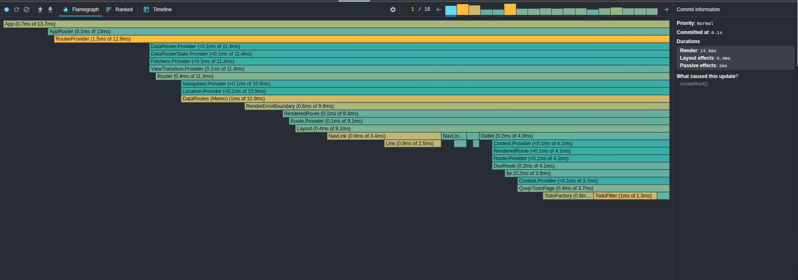 | Initial render.                                                                                                               |
| 02    |  | (fetched) _todos_ arrive, whole list is rendered.                                                                               |
| 03    | 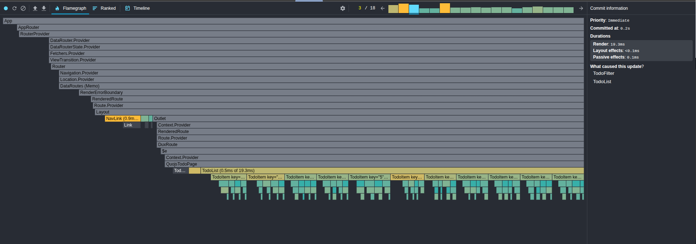 | Filters are re-computed since all fetched _todos_ belong to `fetched` category                                                  |
| 04    |  | The word `test` is **pasted** on `title` field from the todo factory component. Updates are localized to \<TodoFactory /\>    |
| 05    | 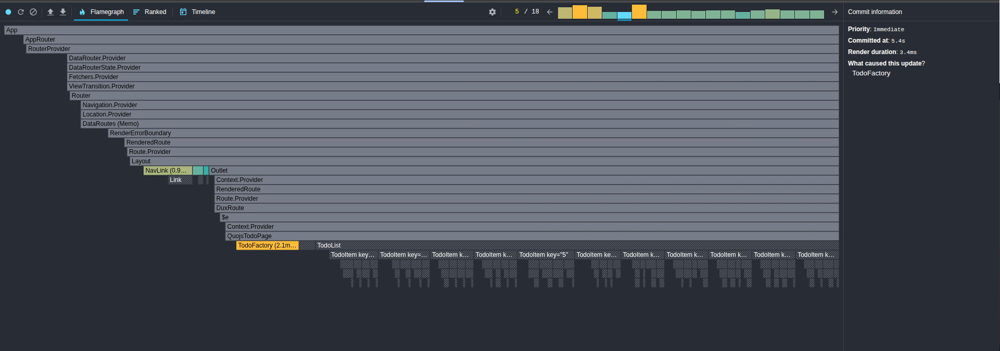 | The word `test` is **pasted** on `category` field from the todo factory component. Updates are localized to \<TodoFactory /\> |
| 06    | 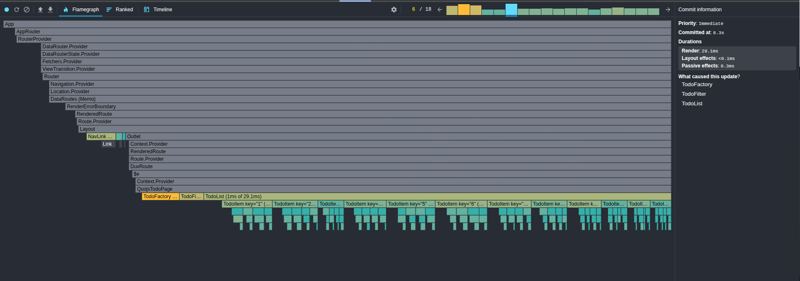 | The `Add` button is pressed, a new todo item has been created. The whole todo list re-renders.                                |
| 07    | 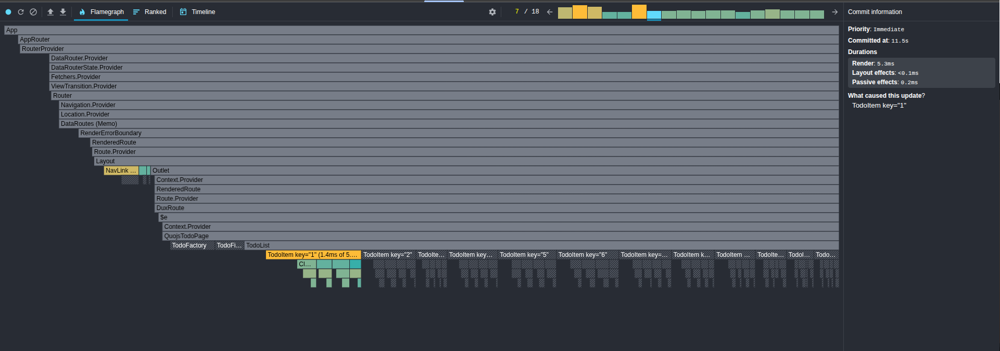 | Todo with ID `1` is toggled, updates to UI are atomic.                                                                        |
| 08    | 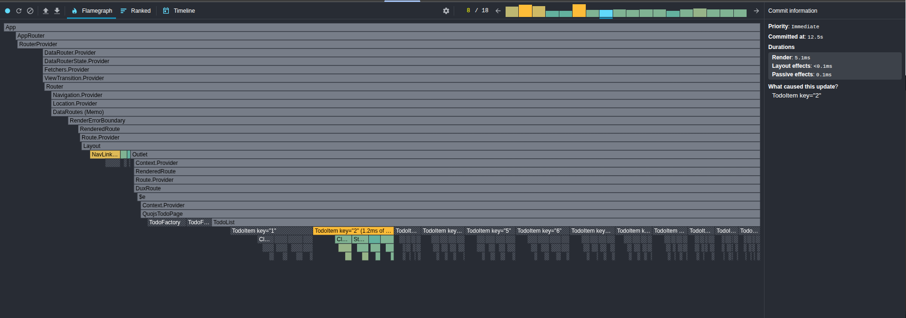 | Todo with ID `2` is toggled, updates to UI are atomic.                                                                        |
| 09    |  | Todo with ID `3` is toggled, updates to UI are atomic.                                                                        |
| 10    | 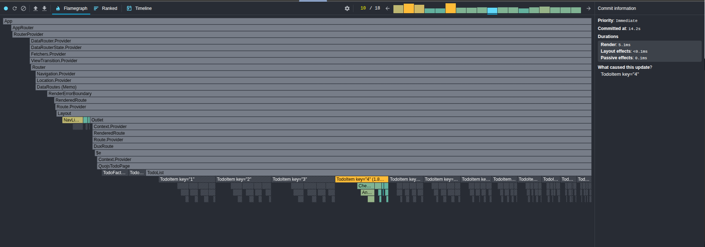 | Todo with ID `4` is toggled, updates to UI are atomic.                                                                        |
| 11    | 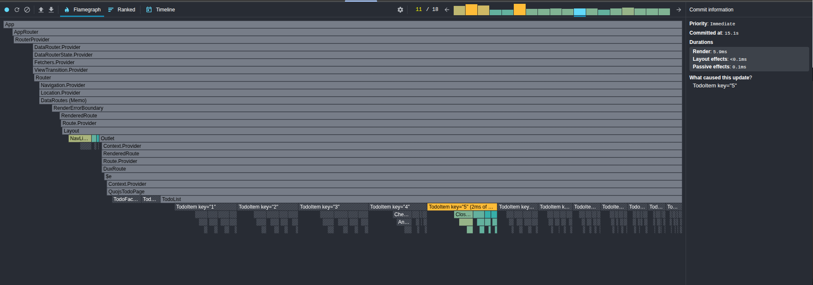 | Todo with ID `5` is toggled, updates to UI are atomic.                                                                        |
| 12    | 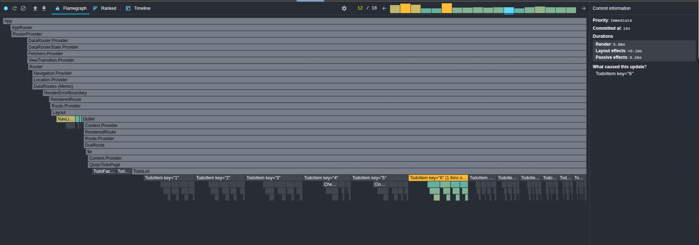 | Todo with ID `6` is toggled, updates to UI are atomic.                                                                        |
| 13    | 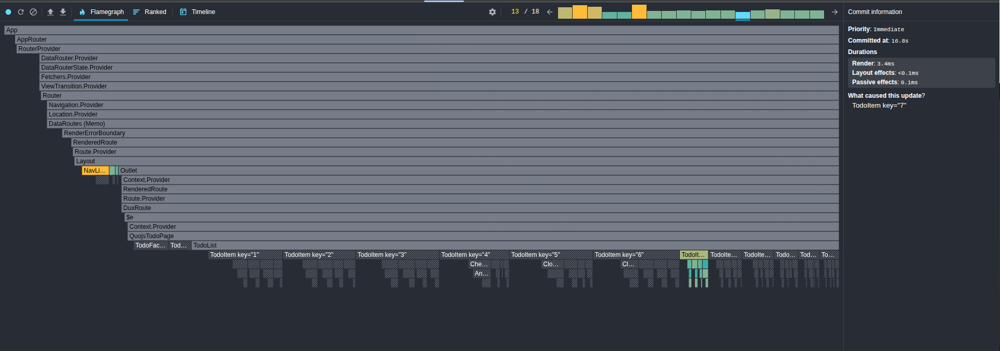 | Todo with ID `7` is toggled, updates to UI are atomic.                                                                        |
| 14    |  | Todo with ID `8` is toggled, updates to UI are atomic.                                                                        |
| 15    |  | Todo with ID `9` is toggled, updates to UI are atomic.                                                                        |
| 16    | 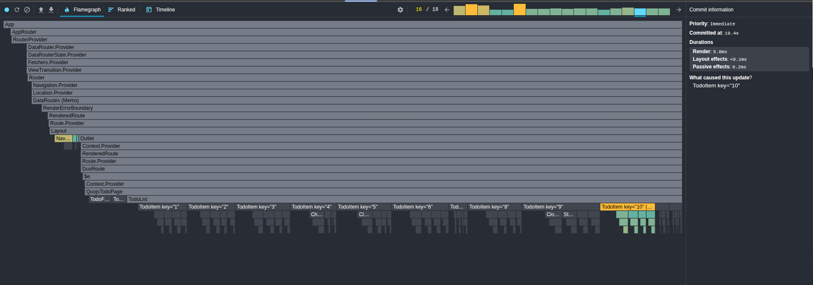 | Todo with ID `10` is toggled, updates to UI are atomic.                                                                       |
| 17    | 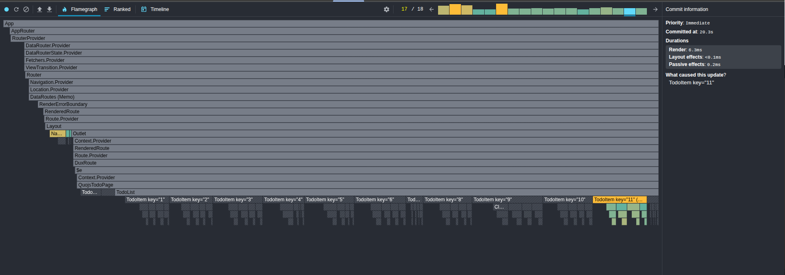 | Todo with ID `11` is toggled, updates to UI are atomic.                                                                       |
| 18    |  | Todo with ID `12` (the one created at frame #6) is toggled, updates to UI are atomic.                                         |

## Redux Toolkit Flamegraphs (Frames 02–10)

RTK shows broader and spikier updates, often waking parent components (`TodoList`, `TodoFilter`)
and multiple items for a single change.

| Frame | Screenshot                                                                        | Notes                                                                                                                         |
| ----- | --------------------------------------------------------------------------------- | ----------------------------------------------------------------------------------------------------------------------------- |
| 02    |  | Initial render.                                                                                                               |
| 03    |  | (fetched) _todos_ arrive, whole list is rendered.                                                                               |
| 03    |        | Filters are re-computed since all fetched _todos_ belong to `fetched` category                                                  |
| 04    | 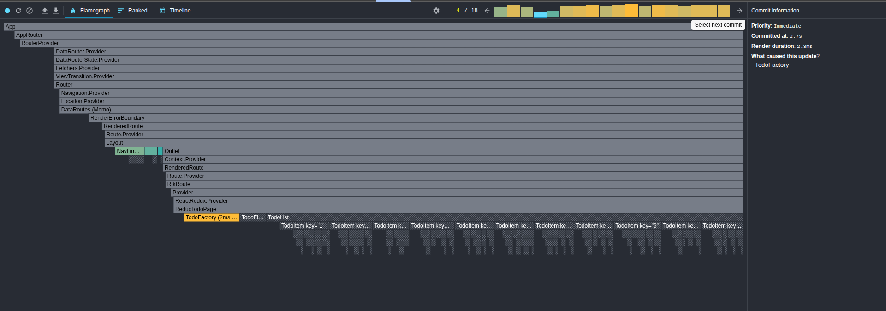 | The word `test` is **pasted** on `title` field from the todo factory component. Updates are localized to \<TodoFactory /\>    |
| 05    |  | The word `test` is **pasted** on `category` field from the todo factory component. Updates are localized to \<TodoFactory /\> |
| 06    | 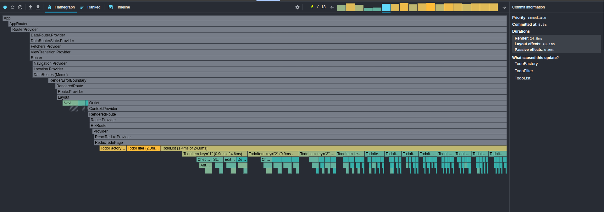 | The `Add` button is pressed, a new todo item has been created. The whole todo list re-renders.                                |
| 07    | 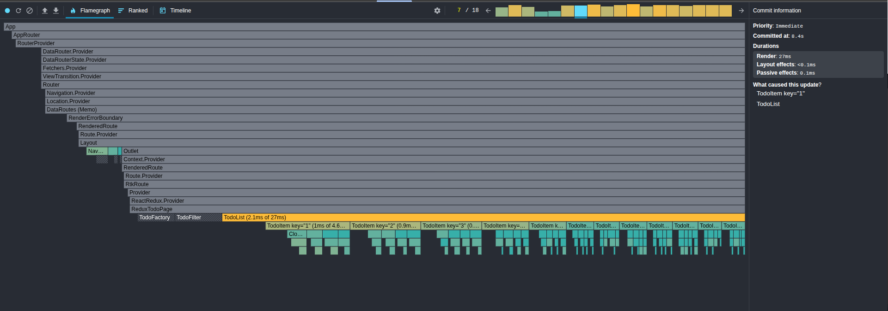 | Todo with ID `1` is toggled, the whole list re-renders.                                                                       |
| 08    | 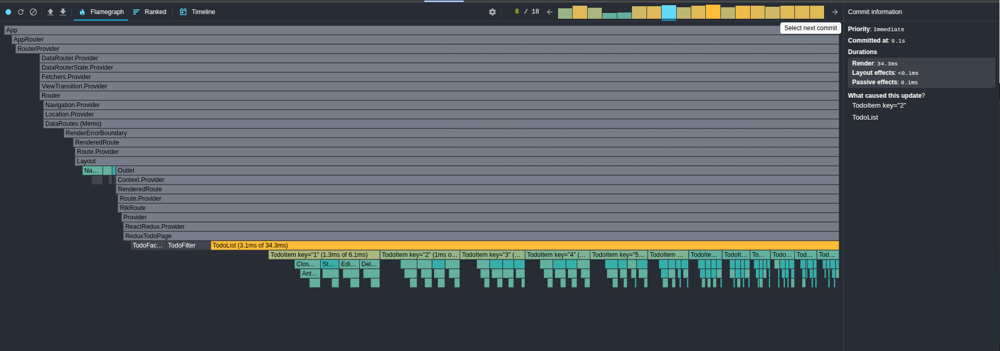 | Todo with ID `2` is toggled, the whole list re-renders.                                                                        |
| 09    |  | Todo with ID `3` is toggled, the whole list re-renders.                                                                        |
| 10    | 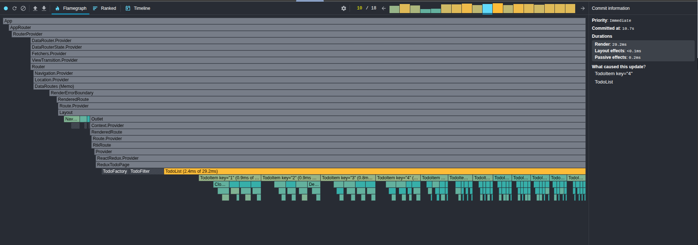 | Todo with ID `4` is toggled, the whole list re-renders.                                                                        |
| 11    |  | Todo with ID `5` is toggled, the whole list re-renders.                                                                        |
| 12    |  | Todo with ID `6` is toggled, the whole list re-renders.                                                                        |
| 13    | 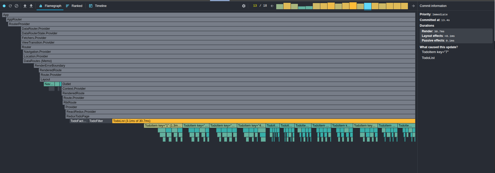 | Todo with ID `7` is toggled, the whole list re-renders.                                                                        |
| 14    |  | Todo with ID `8` is toggled, the whole list re-renders.                                                                        |
| 15    | 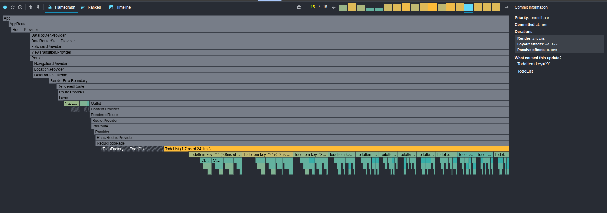 | Todo with ID `9` is toggled, the whole list re-renders.                                                                        |
| 16    | 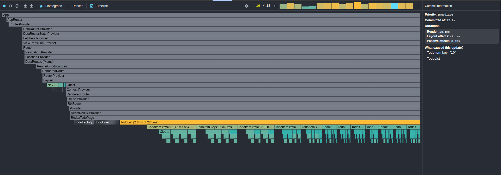 | Todo with ID `10` is toggled, the whole list re-renders.                                                                       |
| 17    |  | Todo with ID `11` is toggled, the whole list re-renders.                                                                       |
| 18    | 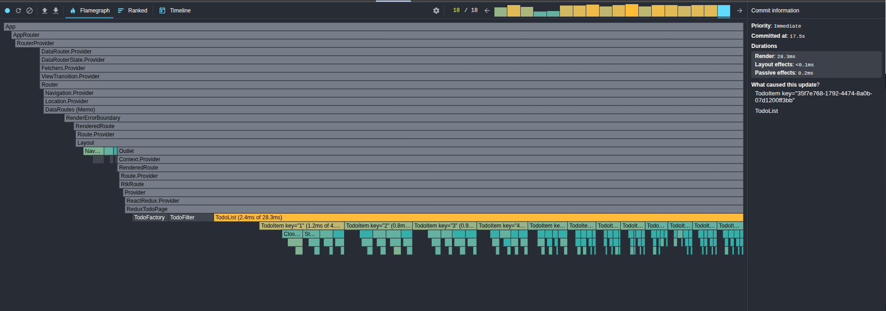 | Todo with ID `12` (the one created at frame #6) is toggled, the whole list re-renders.                                         |

## Key Observations
In RTK's implementation, toggling each todo (12 in total) caused the other 11 to re-render, giving a total of 12 re-renders per toggled todo item. That is 144 re-renders in total! 132 unnecessary re-renders.

1. **Atomic subscriptions (Quo) vs Selector factories (RTK).**

   - Quo: Direct path (`todo.data.4.status`) → one component.
   - RTK: Needs `createSelector` + memoization; easy to get wrong, easy to wake the list.

2. **Wildcard aggregation.**

   - Quo: `todo.filter.*` updates filters automatically.
   - RTK: Must hand-roll per-row selectors; default approach causes whole list churn.

3. **Async effects.**

   - Quo: Built-in cancel/delay semantics.
   - RTK: Must wire custom middleware or thunk chains; no natural cancellation.

4. **Profiler outcome.**
   - Quo flamegraphs: flat, predictable, bounded updates.
   - RTK flamegraphs: broad re-renders, inconsistent commit sizes, higher CPU cost.

## Why This Matters

For small apps, both look “fast enough.”

At scale:

- **Quo scales linearly** with the number of affected items.
- **RTK scales superlinearly** unless you invest heavily in selector discipline.

This demo illustrates **why Quo exists**: to give atomic property subscriptions, async-first
effects, and wildcard aggregation **without developer ceremony**.
